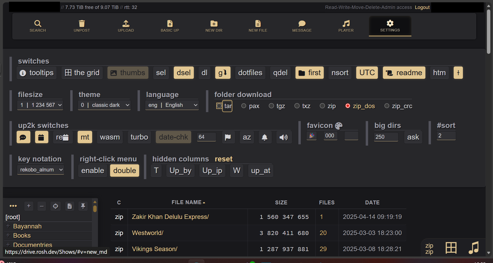
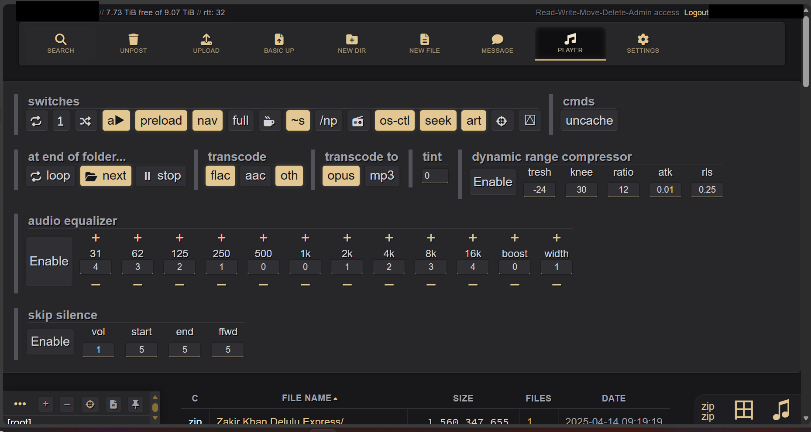

Fileserver Copyparty + White-Gold Theme
=======================================

[copyparty](https://github.com/9001/copyparty) with a professional-looking, dark theme — swaps out all the emoji icons for Font Awesome, brings in a warm zinc + gold color scheme, and tidies up the layout. No original files are touched; it's all done through copyparty's built-in CSS/JS injection flags.

## Screenshots






---

## Getting Started

You just need three flags when launching copyparty:

```bash
copyparty \
  --html-head '<link rel="stylesheet" href="https://cdnjs.cloudflare.com/ajax/libs/font-awesome/6.5.1/css/all.min.css">' \
  --js-browser /path/to/contrib/themes/white-gold.js \
  --css-browser /path/to/contrib/themes/white-gold.css
```

