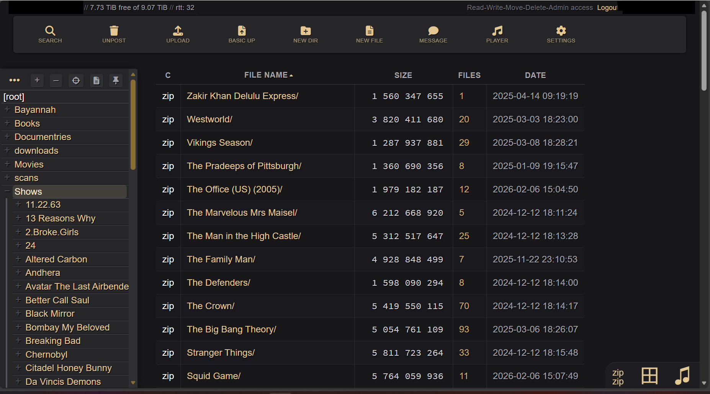

Copyparty + Pro Theme
=====================

Contains fileserver [copyparty](https://github.com/9001/copyparty) + professional-looking, dark theme + startup script. The theme swaps out all the emoji icons for Font Awesome, brings in a warm zinc + gold color scheme, and tidies up the layout. No original files are touched; it's all done through copyparty's built-in CSS/JS injection flags.

Screenshot
----------

Details
-------

* **Start**: `./RUN.ps1`
* **Requirements:** Python (version 2 or 3)
* **URL:** http://localhost:3923 (by default)
* **Version:** copyparty 1.20.14
* **Protocols:** http(s), webdav, sftp, ftp(s), tftp, and smb/cifs supported
* **Theme:** [White-gold](https://github.com/romaan7/white-gold-theme-for-copyparty)
* **Manuals:** [quickstart](https://github.com/9001/copyparty#quickstart), [command-line options](https://copyparty.eu/cli/)
